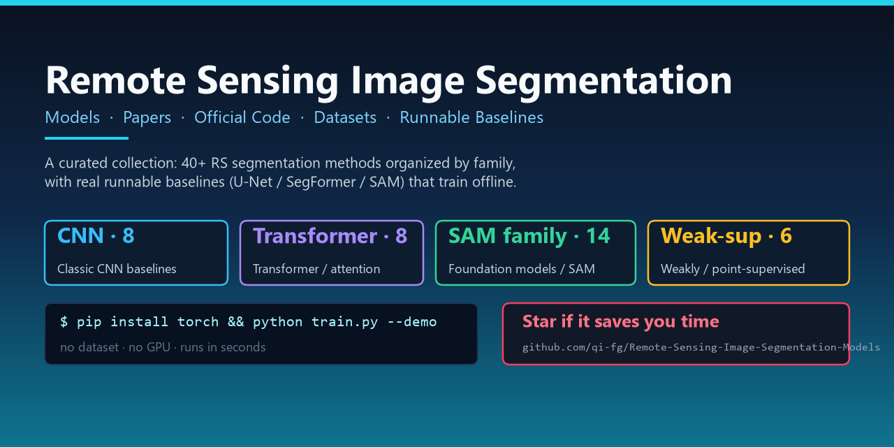

<div align="center">



# 🛰️ Remote-Sensing-Image-Segmentation-Models

**遥感图像分割模型汇总 · 论文 + 官方代码 + 数据集 + 可运行基线**

*A curated collection of Remote Sensing Image Segmentation models — papers, official code, datasets, and runnable baselines.*

[](https://github.com/qi-fg/Remote-Sensing-Image-Segmentation-Models)
[](https://github.com/qi-fg/Remote-Sensing-Image-Segmentation-Models/stargazers)
[](README.md)
[](../../pulls)
[](LICENSE)

**If this collection helps you, a ⭐ means a lot — it keeps the project growing.** 💙

</div>

---

## 📖 这个仓库是什么

遥感图像分割（Remote Sensing Image Segmentation, RSISeg）的方法在近十年爆发式增长：从 **FCN/U-Net 时代的卷积网络**，到 **Transformer 的全局建模**，再到 **SAM/基础模型（Foundation Model）时代的通用分割**，每一年都有新范式。**但方法散落在几百篇论文和几十个官方仓库里，找 baseline、查 SOTA、复现对比极其耗时。**

本仓库就是为解决这个问题而生：

- 📚 **方法总表**：按**方法族**（CNN → Transformer → Foundation/SAM → 弱监督/点监督）整理，含论文、会议/期刊、年份、官方代码、代表数据集。
- 📐 **可运行基线**：`baselines/` 下提供 **真实可跑** 的基线实现（U-Net / SegFormer / SAM wrapper），clone 下来装上依赖就能跑，**自带合成数据冒烟测试，无需数据集、无需 GPU**。
- 📦 **数据集索引**：`datasets.md` 汇总常用 RS 分割数据集（Potsdam / Vaihingen / LoveDA / iSAID / DeepGlobe / WHU / HRSID ...）与下载入口。

> 💡 与"只列链接"的 awesome-list 不同，本仓库**同时提供可运行的参考实现**——你可以直接把它当实验起点，而不是从零搭脚手架。

---

## 📊 收录统计

| 方法族 | 数量 | 关键词 |
| :--- | :---: | :--- |
| 🧱 CNN-based 经典基线 | 8 | FCN · U-Net · DeepLabV3+ · HRNet |
| 🔷 Transformer / Attention | 8 | SegFormer · Mask2Former · SETR · Swin |
| 🚀 Foundation Models / SAM 家族 | 14 | SAM · SAM2 · SAMRS · RSPrompter · RingMo |
| 🎯 弱监督 / 点监督 / 少样本 | 7 | PointSAM · ReSAM · UV-SAM |
| 🔄 变化检测 / 其他 | 4 | Change detection · Panoptic · Text-guided |
| **合计** | **40+** | *持续更新中* |

---

## 🗂️ 方法总表

> 说明：`💻` = 官方代码仓库，`📄` = 论文。部分方法无公开代码则仅列论文。欢迎 PR 补充/修正。

### 🧱 A. CNN-based 经典基线

| 方法 | 年份 | 会议/期刊 | 一句话 | 代码 |
| :--- | :--: | :-- | :-- | :--: |
| **FCN** (Fully Convolutional Networks) | 2015 | CVPR | 首个端到端全卷积分割网络，语义分割开山之作 | 📄 |
| **U-Net** | 2015 | MICCAI | 对称编码-解码 + 跳跃连接，RS/医学通用基线 | 📄 |
| **SegNet** | 2017 | TPAMI | 编码器池化索引上采样，轻量经典 | [💻](https://github.com/alexgkendall/SegNet-Tutorial) |
| **PSPNet** | 2017 | CVPR | 金字塔池化聚合多尺度上下文 | [💻](https://github.com/hszhao/PSPNet) |
| **DeepLabV3+** | 2018 | ECCV | 空洞卷积 + ASPP + 解码器 | [💻](https://github.com/VainF/DeepLabV3Plus-Pytorch) |
| **U-Net++** | 2018 | MICCAI-W | 嵌套密集跳跃连接 | [💻](https://github.com/MrGiovanni/UNetPlusPlus) |
| **HRNet** | 2020 | TPAMI | 全程保持高分辨率表征 | [💻](https://github.com/HRNet/HRNet-Semantic-Segmentation) |
| **ResUNet-a** | 2020 | ISPRS J. | 残差 U-Net，面向遥感"全场景"分割 | 📄 |

### 🔷 B. Transformer / Attention

| 方法 | 年份 | 会议/期刊 | 一句话 | 代码 |
| :--- | :--: | :-- | :-- | :--: |
| **SETR** | 2021 | CVPR | 首个把 ViT 当编码器的分割网络 | [💻](https://github.com/fudan-zvg/SETR) |
| **SegFormer** | 2021 | NeurIPS | 分层 Transformer + 轻量 MLP 解码器，高效 SOTA | [💻](https://github.com/NVlabs/SegFormer) |
| **Segmenter** | 2021 | ICCV | 纯 Transformer + mask 解码 | [💻](https://github.com/rstrudel/segmenter) |
| **Swin-Unet** | 2021 | arXiv | Swin Transformer 版 U-Net | [💻](https://github.com/HuCaoFighting/Swin-Unet) |
| **DPT** | 2021 | ICCV | ViT + 密集预测头，强 zero-shot 迁移 | [💻](https://github.com/isl-org/DPT) |
| **UperNet** | 2018 | ECCV | 通用金字塔解码头，常配 Swin/ConvNeXt | [💻](https://github.com/open-mmlab/mmsegmentation) |
| **Mask2Former** | 2022 | CVPR | 通用掩码注意力，语义/实例/全景统一 | [💻](https://github.com/facebookresearch/Mask2Former) |
| **ViT-Adapter** | 2023 | ICLR | 给 ViT 加空间先验适配密集预测 | [💻](https://github.com/czczup/ViT-Adapter) |

### 🚀 C. Foundation Models / SAM 家族 & RS 基础模型 ★本仓库重点

| 方法 | 年份 | 会议/期刊 | 一句话 | 代码 |
| :--- | :--: | :-- | :-- | :--: |
| **SAM** (Segment Anything) | 2023 | ICCV | 十亿级掩码训练的通用分割基础模型 | [💻](https://github.com/facebookresearch/segment-anything) |
| **SAM 2** | 2024 | Meta | 图像 + 视频的流式可提示分割 | [💻](https://github.com/facebookresearch/sam2) |
| **SAMRS** | 2023 | NeurIPS D&B | 用 SAM + 检测数据生成的大规模 RS 分割数据集（10w 图/166w 实例） | [💻](https://github.com/ViTAE-Transformer/SAMRS) |
| **RSPrompter** | 2024 | TGRS | 自动学习 prompt，SAM 用于 RS 实例分割 | [💻](https://github.com/KyanChen/RSPrompter) |
| **HSA-SAM** | 2024 | — | 分层区域 + SAM，面向 RS 语义分割 | [💻](https://github.com/mafanhao666/HSA-SAM) |
| **GeoSAM** | 2024 | arXiv | 多模态 prompt 微调 SAM，基础设施分割 | 📄 |
| **RingMo** | 2022 | TGRS | 遥感基础模型，掩码图像建模预训练 | 📄 |
| **RingMo-SAM** | 2023 | TGRS | 多模态遥感分割基础模型 | 📄 |
| **RVSA** | 2022 | TGRS | 旋转可变自注意力，把普通 ViT 推向 RS 基础模型 | [💻](https://github.com/ViTAE-Transformer/Remote-Sensing-RVSA) |
| **SatMAE** | 2022 | NeurIPS | 时序 + 多光谱卫星图像的 MAE 预训练 | [💻](https://github.com/sustainlab-group/SatMAE) |
| **Scale-MAE** | 2023 | CVPR | 尺度感知 MAE，学习跨分辨率表征 | [💻](https://github.com/bair-climate-initiative/scale-mae) |
| **CROMA** | 2024 | ICLR | 对比 + MAE 双目标的遥感多模态表征 | [💻](https://github.com/antofuller/CROMA) |
| **SpectralGPT** | 2024 | TPAMI | 光谱遥感基础模型，生成式预训练 | [💻](https://github.com/danfenghong/IEEE_TPAMI_SpectralGPT) |
| **segment-geospatial** | 2023 | 工具 | 把 SAM/SAM2 封装成地理空间分割工具链（samgeo） | [💻](https://github.com/opengeos/segment-geospatial) |

> 🔎 这一族是当前 RS 分割最大的增长点。**从"每类地物训一个模型"到"一个基础模型 + prompt 通吃"** 是 2024–2026 的主线。

### 🎯 D. 弱监督 / 点监督 / 少样本

| 方法 | 年份 | 会议/期刊 | 一句话 | 代码 |
| :--- | :--: | :-- | :-- | :--: |
| **ReSAM** ⭐ | 2026 | CVPR | 自提示闭环 Refine–Requery–Reinforce + 软语义对齐(SSA)，1 点标注逼近全监督，训练显存比 PointSAM 低 84% | [💻](https://github.com/MNaseerSubhani/ReSAM) |
| **PointSAM** ⭐ | 2025 | TGRS | 点监督微调 SAM：原型正则(PBR) 用匈牙利匹配纠偏伪标签 + 负提示校准(NPC) 抑制实例粘连 | [💻](https://github.com/Lans1ng/PointSAM) |
| **UV-SAM** | 2024 | AAAI | 把 SAM 适配到"城中村识别"（弱监督场景） | 📄 |
| **Text2Seg** | 2023 | arXiv | 文本引导的视觉基础模型 RS 分割 | [💻](https://github.com/zhangjielu321/Text2Seg) |
| **Point-supervised RS Seg** | 2023 | TGRS | 点标注驱动的弱监督分割范式 | 📄 |
| **Box-supervised RSI Seg** | 2023 | TGRS | 框标注弱监督 RS 分割 | 📄 |
| **Zero-shot RS Seg (SAM)** | 2023 | JAG | 评估 SAM 在 RS 的 zero/one-shot 能力 | 📄 |

> 🎯 标注成本是 RS 的真实瓶颈。**点/框/文本等弱监督 + 基础模型** 是降低标注成本的关键方向。

**点监督 SAM 适配路线**（本仓库重点关注）：

```
阶段 1 · 原型对齐纠偏          阶段 2 · 自提示闭环 + 语义对齐       阶段 3 · 开放前沿
PointSAM (TGRS'25)   ──▶   ReSAM (CVPR'26)          ──▶   待补充
PBR 原型正则 +                 Refine–Requery–        不确定性建模 · 跨传感器泛化
NPC 负提示校准                 Reinforce (R³) + SSA   · 更少标注预算（欢迎 PR）
显存重（原型库）               省 84% 显存：滚动队列
```

### 🔄 E. 变化检测 / 其他任务

| 方法 | 年份 | 会议/期刊 | 一句话 | 代码 |
| :--- | :--: | :-- | :-- | :--: |
| **SAM-based Change Detection** | 2024 | TGRS | 用 SAM 适配 VHR 变化检测 | 📄 |
| **ChangeFormer** | 2022 | IGARSS | Transformer 变化检测 | [💻](https://github.com/wgcban/ChangeFormer) |
| **Panoptic RS Seg** | 2024 | — | 遥感全景分割 | 📄 |
| **Road-SAM** | 2024 | GRSL | SAM 适配大幅 VHR 道路提取 | 📄 |

---

## 📐 可运行基线

`baselines/` 下是**真实可运行**的参考实现（不是伪代码），每个都带 **合成数据冒烟测试**，`--demo` 一键跑通，**不依赖真实数据集、无需 GPU**：

| 基线 | 类型 | 说明 | 快速验证 |
| :--- | :-- | :-- | :-- |
| [`baselines/unet/`](baselines/unet) | CNN | 纯 PyTorch U-Net（含 Dice+CE 损失、二分类/多类） | `python train.py --demo` |
| [`baselines/segformer/`](baselines/segformer) | Transformer | SegFormer-B0 封装（timm 骨干 + 轻量解码头） | `python train.py --demo` |
| [`baselines/sam_rs/`](baselines/sam_rs) | Foundation | SAM prompt 分割封装（点/框 prompt → mask） | `python predict.py --demo` |

```bash
git clone https://github.com/qi-fg/Remote-Sensing-Image-Segmentation-Models
cd Remote-Sensing-Image-Segmentation-Models/baselines/unet
pip install -r requirements.txt
python train.py --demo     # 合成数据，CPU 几秒跑完，输出 mIoU
```

---

## 📦 数据集

常用基准与下载入口见 **[`datasets.md`](datasets.md)**，覆盖：

- **语义分割**：ISPRS Potsdam / Vaihingen · LoveDA · iSAID · DeepGlobe · GID
- **实例分割**：iSAID · NWPU VHR-10 · DOTA（SAMRS 转换源）
- **建筑物/道路**：WHU Building · Massachusetts Roads
- **变化检测**：LEVIR-CD · WHU-CD

---

## 🤝 贡献指南

非常欢迎一起完善这个集合！你可以：

1. **补充方法**：按上表格式新增一行（方法名 / 年份 / 会议 / 一句话 / 代码链接）
2. **修正错误**：年份、venue、链接有误直接改
3. **补充基线**：在 `baselines/` 下新增可运行实现（需带 `--demo` 冒烟测试）
4. **新增数据集**：更新 `datasets.md`

**提交方式**：Fork → 新建分支 → 修改 → 提 PR。或在 [Issues](../../issues) 里直接告诉我。

> 📌 数据由社区整理，难免有滞后或疏漏，**发现错误欢迎提 Issue/PR**，一起让它更准。

---

## ⭐ Star History

如果这个仓库帮你省下了找 baseline / 查 SOTA 的时间，点个 Star 就是最大的支持：

[](https://star-history.com/#qi-fg/Remote-Sensing-Image-Segmentation-Models&Date)

---

## 📄 License

本项目以 [MIT License](LICENSE) 开源。各方法代码的版权归其原作者所有，请遵循各自仓库的许可证。

<div align="center">

**Made with 🛰️ by [qi-fg](https://github.com/qi-fg)**

*Remote Sensing · Hyperspectral Classification · Agentic Vision*

</div>
